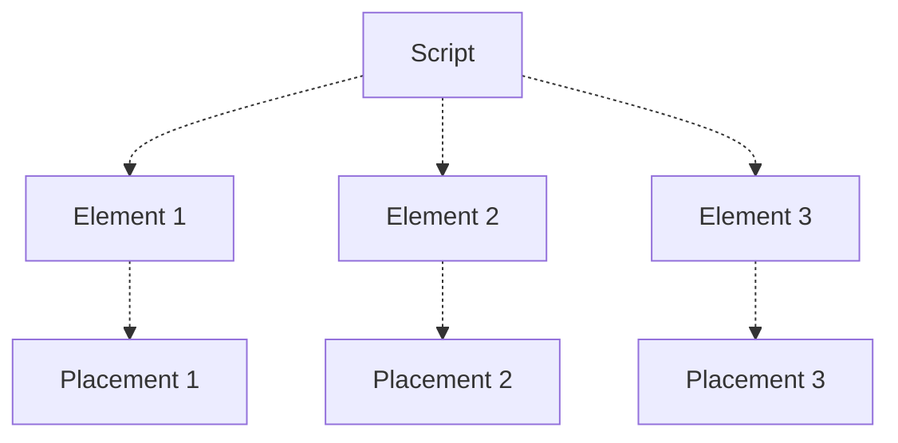

# Dynamic script
> Dynamic monetization script that creates multiple ad placements per load

The dynamic monetization script is Kiosked's intelligent ad placement library that builds placements dynamically based upon injected configurations. Kiosked staff will tweak and update values internally that are reflected within the script itself - the amount of banners, their locations and their behaviours are just some of the many aspects that can be tweaked remotely.

Dynamic scripts offer a huge efficiency gain over [static tags](script/introduction_statictag.md) due to the fact that only one script load is required. Once loaded the dynamic script will proceed to create any number of configured ad placements.

## Placement identification

Placement locations are identified by provided configurations embedded within each script. Locations where placements are created are simply [CSS selectors](https://developer.mozilla.org/en-US/docs/Learn/CSS/Introduction_to_CSS/Selectors) that describe _which elements_ should have ads created on or near them.



For example, the selector `.content p` would tell the script that every `<p>` tag within the `.content` element should be selected for ad creation. Other rules will configure the frequency and maximum number of banners.

> Changing the theme or layout of a site can affect Kiosked dynamic scripts in that placements may no longer be created after the change. This is of course dependent on the scale of the change and what the structure is after the update. It is imperative to notify Kiosked staff immediately if this has occurred, but of course prior notice is preferrable.

## Script location/injection

It is desirable to place the dynamic script within the `<head>` block. While some documentation online may recommend against this, it is perfectly fine to place the Kiosked script in the head due to the presence of an `async` flag which prevents the blocking of the page. Even if Kiosked's services were to become intermittently unavailable, there would be no negative affect on the publisher's pages besides the lack of placements created by Kiosked.

If it simply isn't possible to place the script within the head block, placing it in the `<body>` towards the bottom is fine.

### Injection via an ad server

It is **not recommended** to inject this script using DFP or any other loader or ad server. That being said, if there isn't another alternative the dynamic script can be injected via an ad server (such as DFP) if:

 * No safe-frames are used
 * The ad server allows access to the top frame of the page

Injection can be achieved by writing the script from a **1x1** ad server placement into the top frame of the page, using a script like the following (provided by Kiosked):

```html
<!-- Begin Kiosked (DFP) -->
<script type="text/javascript">
(function(s, w) {
  s.setAttribute("async", "async");
  s.setAttribute("type", "text/javascript");
  s.setAttribute("src", "//scripts.kiosked.com/loader/kiosked-loader.js?site=DYNAMICID");
  w.document.body.appendChild(s);
})(window.top.document.createElement("script"), window.top);
</script>
<!-- End Kiosked (DFP) -->
```

Notice the call to `w.document.body.appendChild(s)`, where the dynamic script is written to the top frame's `<body>`.

## Configuration

The dynamic script is configured by Kiosked staff and can be set up to create a variety of different placement opportunities with many different configurations. Once a dynamic script has been deployed to a site, there is usually nothing more required in terms of implementation from the publisher side. Requests can be made to Kiosked for additional units or alternate configurations without the need for additional tags to be deployed.

In this way, Kiosked operates similar to a managed ad server, but without the need for templates.

## Compatibility

The dynamic script is compatible in all of the latest versions of **Chrome**, **Firefox**, **Edge** and **Safari**. It should function with the majority of its base functionality on Internet Explorer 10 and above.

It is also compatible with current mobile browsers such as Mobile Safari and Chrome for mobile. Opera Mini is **not supported**. The script is not guaranteed to work in embedded browsers.
